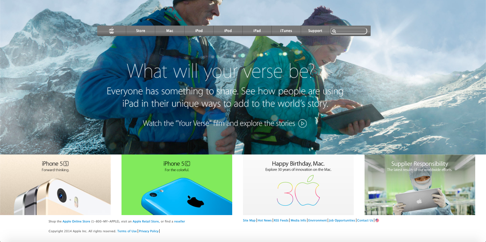

# HTML forms

> This is the fourth project of Microverse.

## Live link

https://raw.githack.com/afcastaneda223/4th-Microverse-solo-project/master/index.html

BUILDING WITH BACKGROUNDS AND GRADIENTS

## Built With

- HTML,
- CSS,

## GitHub Repo

- https://github.com/afcastaneda223/4th-Microverse-solo-project

## Authors

👤 **Andres Felipe Castañeda Ramos**

- Github: [@afcastaneda223](https://github.com/afcastaneda223)
- Twitter: [@afcastaneda](https://twitter.com/afcastaneda)
- Linkedin: [Andres Felipe Castañeda](www.linkedin.com/in/andres-castaneda223)

## Show your support

Give a ⭐️ if you like this project!

## Acknowledgments

- Microverse
- Everyone else

## 📝 License

Distributed by the GNU General Public License. See `LICENSE` for more information.
